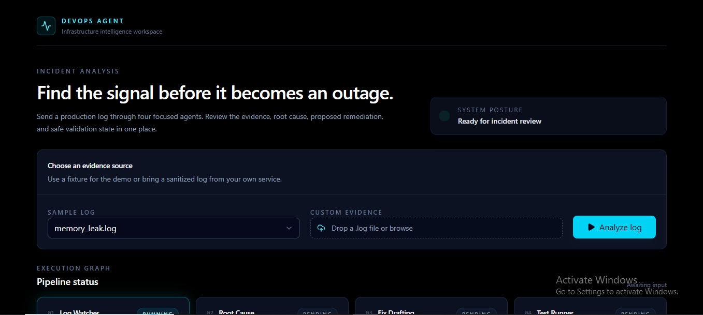
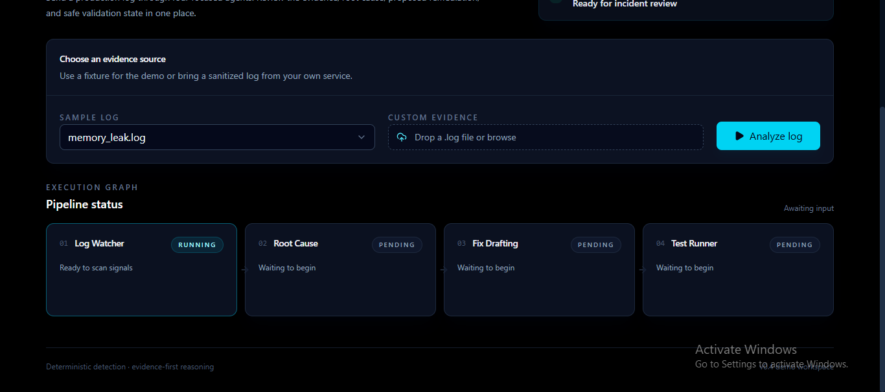
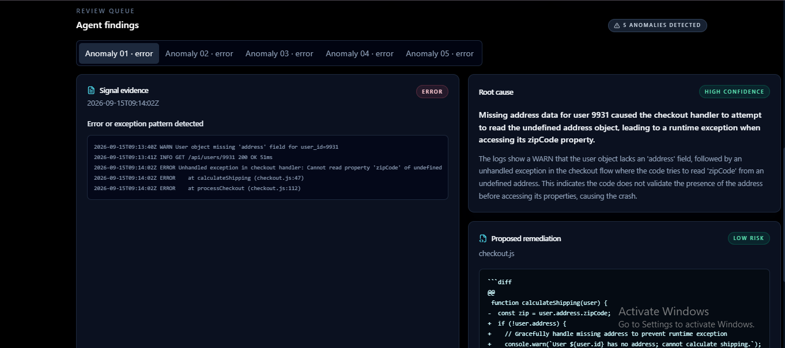

# DevOps Agent

A multi-agent DevOps and infrastructure monitoring system that watches logs, detects anomalies, and drafts root-cause diagnoses — built as a portfolio project to demonstrate agentic AI orchestration on real infrastructure signals.

## Screenshots

### Dashboard Home


### Agent Stages / Pipeline


### Agent in Action



## Project layout

```
devops-agent/
├── backend/                  # FastAPI server and Python agent logic
│   ├── agents/                # one file per agent
│   ├── core/                  # shared orchestration and LLM abstraction
│   ├── api/                   # FastAPI routes
│   └── data/sample_logs/      # synthetic log fixtures for testing
└── frontend/                 # React + Vite + TypeScript dashboard
```

## Tech stack

- **Backend:** FastAPI, Python, Gemini / Groq (LLM abstraction)
- **Frontend:** React, Vite, TypeScript

## Backend setup

```bash
cd backend
python -m venv .venv

# Windows PowerShell
.\.venv\Scripts\Activate.ps1
# macOS/Linux
source .venv/bin/activate

pip install -r requirements.txt
```

Create a local `.env` file in the backend folder from `.env.example` and add your API keys:

```bash
cd backend
copy .env.example .env
```

Then update the values:

```env
GEMINI_API_KEY=your_gemini_api_key_here
GROQ_API_KEY=your_groq_api_key_here
```

### Run FastAPI

```bash
cd backend
uvicorn main:app --reload
```

Visit: `http://localhost:8000/health`

## Frontend setup

```bash
cd frontend
npm install
npm run dev
```

## Current status

This scaffold includes:

- A working FastAPI app with a health endpoint
- A deterministic log watcher agent for anomaly detection
- Sample log fixtures for timeout, null-pointer, and latency/memory-leak scenarios
- A basic environment file template
- A React dashboard connected to the backend (see screenshots above)

## Next steps

- Add the Gemini/Groq LLM abstraction
- Add the root-cause analysis and fix-drafting agents
- Wire the dashboard to surface anomalies and diagnoses end-to-end